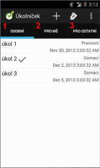
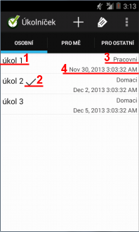
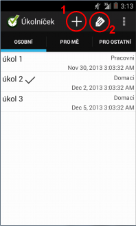
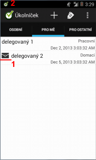
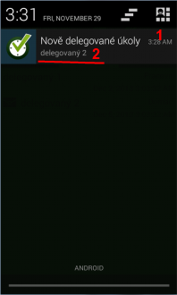
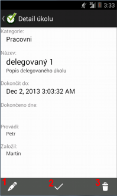
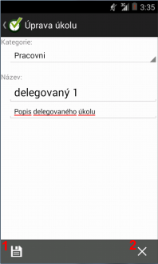
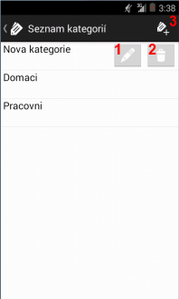
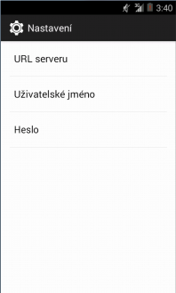

Úkolníček pro Android
=====================
Popis aplikace
--------------
Aplikace pro evidenci úkolů pro mobilní telefony s operačním systémem Android.
Aplikace umožňuje ukládání dat do lokální databáze v telefonu, ale umožňuje také data ukládat do vzdálené databáze. Serverová strana JBoss, databáze SQL Server.

Požadavky
----------
* Uživatelé se do aplikace přihlašují přes uživatelské jméno a heslo.
* Data budou ukládána do databáze.
* Vytvářet, editovat, mazat a dokončovat úkoly.
* Vytvářet, editovat, mazat kategorie úkolů.
* Je možné založit úkol pro jiného uživatele.
* Notifikace (notifikace na liště doprovázená zvukem a vibrací) uživatele, po přihlášení do aplikace, že mu byl založen nový úkol.

Struktura
---------
###Úkol
  1. Každý úkol patří právě do jedné kategorie.
  2. Obsahuje: název, popis, datum do kdy má být splněn, datum kdy byl splněn, uživatele který ho založil a uživatele který ho splnil.
  3. Název úkolu je povinný parametr.
  4. Datum do kdy má být úkol splněn je nepovinný parametr.

###Kategorie
  1. Je definována pouze názvem.
  2. Může obsahovat 0-N úkolů.

Aplikační omezení
-----------------
* Kategorie, které neobsahují úkoly, je možné upravovat/mazat.
* Upravovat úkol lze pouze tehdy, pokud není uzavřen.
* Odstranit úkol lze pouze tehdy, jedná-li se o úkol mnou založený.
* Úkoly delegované na mne nemohu odstranit a ani jim nemohu změnit datum, do kdy mají být dokončeny.
* Seznam všech uživatelů a kategorií je dostupný všem.
* Přihlášený uživatel vidí jen úkoly: své vlastní (založil je pro sebe), delegované na něj (někdo úkol založil pro mě), delegované někomu jinému (založil jsem úkol někomu jinému).

Externí knihovny a Framework
----------------------------
* Na straně databáze jsem použil [SQL Server 2005 Express](http://www.microsoft.com/en-us/download/details.aspx?id=21844).
* Pro administraci databáze [Microsoft SQL Server Management Studio Express](http://www.microsoft.com/en-us/download/details.aspx?id=8961).
* Aplikační server je [JBoss 7.1.1](http://download.jboss.org/jbossas/7.1/jboss-as-7.1.1.Final/jboss-as-7.1.1.Final.zip).
* Vývojové IDE: [Eclipse](http://www.eclipse.org/downloads/) Kepler Service Release 1.
* Objektově relační mapování: Hibernate.
* Rozhraní pro komunikaci s klientem: RestEasy.
* Autentifikace/Autorizace: JBoss JAAS, metoda BASIC.
* Parsování JSON objektů na klientu: [Jackson](http://jackson.codehaus.org/).
* Klient: Android.

Instalace
=========
Databáze
--------
1. Stáhnout a nainstalovat [SQL Server 2005 Express](http://www.microsoft.com/en-us/download/details.aspx?id=21844).
2. Pro správu databáze používám Microsoft SQL Server Management Studio Express dostupný [zde](http://www.microsoft.com/en-us/download/details.aspx?id=8961).
3. Na disku C:\ si založte adresář *TaskManager* a v něm adresář *db*. Do tohoto adresáře bude založena databáze (soubor TaskManager.mdf).
4. Skript pro založení databáze je [zde](task-manager-db/CreateDatabaseScript.sql).
   - Skript založí databázi s názvem *TaskManager* do připraveného adresáře z bodu 3.
   - Založí aplikačního uživatele *taskManager_app* (heslo: taskManager_app) pomocí kterého se bude JBoss připojovat k databázi.
   - Do databáze založí tabulky LOGIN (tabulka uživatelů), TSK (tabulka úkolů) a TSK_CATEG (tabulka kategorií).
   - Založí dvě kategorie: *Pracovni* a *Domaci*.
   - Založí tři uživatele:
      - Petr (uživatelské jméno: petr, heslo: taskmanager).
      - Martin (uživatelské jméno: martin, heslo: taskmanager).
      - Tomas (uživatelské jméno: tomas, heslo: taskmanager).
5. Po instalaci překontrolovat:
    * Zda je SQL server spuštěný.
    * Zda je zapnutá služba *SQL Server Browser*.
    * Zda je povoleno TCP/IP spojení na portu 1433.
    * Zda je uživatel *taskManager_app* platný a povolený.
6. Databáze je připravena.

JBoss 7.1.1
-----------
1. Stáhnout a rozbalit JBoss 7.1.1 dostupný [zde](http://download.jboss.org/jbossas/7.1/jboss-as-7.1.1.Final/jboss-as-7.1.1.Final.zip).
2. Do adresáře *%JBOSS_HOME%\jboss-as-7.1.1.Final\* nakopírovat veškerý obsah z [task-manager-jboss](task-manager-jboss/). Adresář obsahuje potřebnou knihovnu pro připojení do databáze a konfigurační XML (standalone-taskManager.xml).
3. Přidat server do Eclipse. Návod je [zde](https://docs.jboss.org/author/display/AS7/Starting+JBoss+AS+from+Eclipse+with+JBoss+Tools). Důležité je, aby server měl nastavený *Configuration file* na *standalone-taskManager.xml* získaný z bodu 2.
4. Přidat výsledný ear do JBossu.
5. Spustit JBoss. Pokud je vše v pořádku, výsledkem by měla být zpráva v logu *Deployed "task-manager-ear.ear"*.

Nyní již lze testovat RESTové služby pomocí nichž klient komunikuje se serverem. K testování používám [RESTClient](https://addons.mozilla.org/cs/firefox/addon/restclient/) doplněk ve Firefoxu.
URL na služby je [http://localhost:8080/task-manager-war/rest/](http://localhost:8080/task-manager-war/rest/).

Implementace RESTových služeb je [zde](task-manager-war/src/main/java/cz/czechGeeks/taskManager/server/rest).

Android
-------
Do Eclipse jsem instaloval pomocí [tohoto](http://mobil.idnes.cz/naucime-vas-programovat-aplikace-pro-android-zaciname-prave-dnes-phe-/aplikace.aspx?c=A120410_125436_aplikace_ham) návodu.

Popis projektů
==============
* <B>task-manager-android:</B> Obsahuje implementaci klientské části pro Android.
* <B>task-manager-ejb:</B> Osahuje business logiku na straně serveru. Obsahuje DAO, Entity a servisní EJB pro tyto entity.
* <B>task-manager-war:</B> Zajišťuje komunikaci klienta a serveru pomocí RESTových služeb. Komunikace je implementována pomocí JSON formátu.
* <B>task-manager-parent-pom:</B>  Obsahuje pouze definice závislostí pro Maven.
* <B>task-manager-ear:</B> Zabaluje předešlé projekty (krom androidu) do jednoho balíku, který se nasazuje do JBossu.
* <B>task-manager-db:</B> Obsahuje pouze script pro založení databáze.
* <B>task-manager-jboss:</B> Obsahuje pouze knihovnu pro spojeni do databáze a descriptor pro JBoss.
* <B>task-manager-printScreen:</B> Obsahuje pouze náhledy aplikace.

Náhledy
=======
### Seznam úkolů - záložky

1. Osobní: úkoly jsem založil sám pro sebe.
2. Pro mě: úkoly, které někdo delegoval na mě.
3. Pro ostatní: úkoly, které jsem delegoval na někoho jiného.

### Seznam úkolů - položky

1. Název úkolu.
2. Příznak, že je úkol uzavřen.
3. Kategorie úkolu.
4. Datum, do kdy má být úkol splněn.

### Seznam úkolů - tlačítka

1. Založení nového úkolu do právě otevřené záložky.
2. Zobrazení seznamu kategorií úkolů.

### Delegované úkoly

1. Příznak, že jsem úkol ještě nečetl (nezobrazil jsem si detail).
2. Notifikace, že byl pro mě založen nový úkol.

### Notifikace

1. Notifikace o nově založeném úkolu, který mám splnit.
2. Název nově založeného úkolu. Pokud je úkolů více, pak jsou názvy oddělené čárkou.

### Náhled úkolu

1. Editace úkolu.
2. Ukončení úkolu.
3. Odstranění úkolu (POZOR! Nezobrazuje potvrzovací dialog).

### Editace úkolu

1. Uložení změn.
2. Storno.

### Seznam kategorií

1. Editace kategorie.
2. Odstranění kategorie (POZOR! Nezobrazuje potvrzovací dialog).
3. Založení nové kategorie.

### Nastavení

Bug
====
* Pokud si chcete hrát s delegováním úkolů na jednom zařízení, tak pro přihlášení se do aplikace jako jiný uživatel, je nejprve potřeba změnit uživatelské jméno/heslo v nastavení aplikace. Pak je potřeba aplikaci zavřít a opět spustit.
* Aplikace nijak neinformuje uživatele, že byl překročen datum, do kdy měl být úkol splněn.
* Neobsahuje optimalizace pro "Landscape" (zobrazení na šířku).
* Delegovaný úkol může zakladatel lehce přehodit na někoho jiného. Původní uživatel, který měl úkol splnit, o tom není nijak informován.

Kontakt
=======
V případě nejasností, otázek či jakýchkoli připomínek mě můžete kontaktovat na [lukber@seznam.cz](mailto:lukber@seznam.cz).
